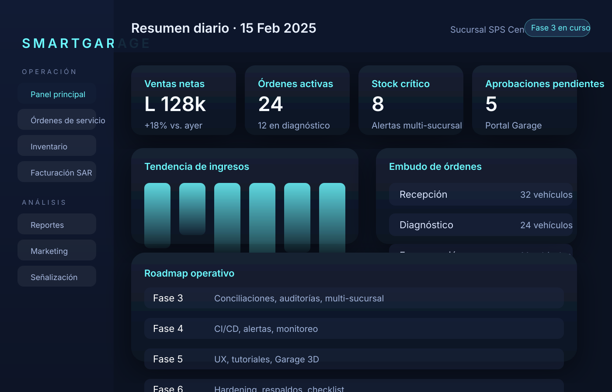
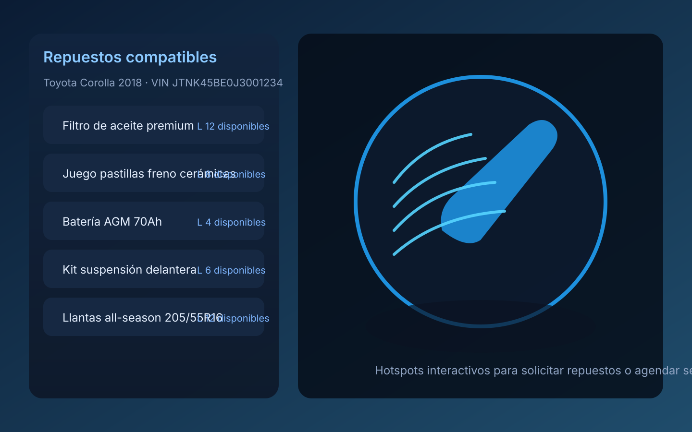

# Plataforma de Gestión de Taller Automotriz

[](LICENSE)

Este repositorio alberga una plataforma integral para la gestión de talleres automotrices con soporte multi-sucursal, portal de clientes con experiencia 3D, módulos de inventario, facturación compatible con el SAR de Honduras y herramientas administrativas orientadas a operación, marketing y contabilidad.

## Tabla de contenidos

1. [Visión general](#visión-general)
2. [Vista previa del dashboard](#vista-previa-del-dashboard)
3. [Vista previa del Garage 3D](#vista-previa-del-garage-3d)
4. [Estado actual del proyecto](#estado-actual-del-proyecto)
5. [Roadmap por fases](#roadmap-por-fases)
6. [Estructura del repositorio](#estructura-del-repositorio)
7. [Requisitos](#requisitos)
8. [Instalación rápida en Ubuntu](#instalación-rápida-en-ubuntu)
9. [Variables de entorno](#variables-de-entorno)
10. [Ejecución en desarrollo](#ejecución-en-desarrollo)
11. [Pruebas](#pruebas)
12. [Despliegue](#despliegue)
13. [Documentación complementaria](#documentación-complementaria)

## Visión general

- **Dominio**: Gestión integral de talleres automotrices con enfoque en inventario, órdenes de trabajo, facturación SAR y experiencia del cliente.
- **Arquitectura**: API REST en Node.js/Express + Prisma (PostgreSQL) y SPA React/Vite con integración Babylon.js para el Garage 3D.
- **Objetivo**: Entregar una solución lista para operar, instalable directamente sobre Ubuntu sin contenedores y respaldada por documentación técnica y script de instalación.

## Vista previa del dashboard

> Captura conceptual del panel administrativo que ilustra los indicadores clave y el roadmap activo de la plataforma.



## Vista previa del Garage 3D

> Mockup del portal de clientes resaltando la navegación 3D, hotspots interactivos y catálogo filtrado por VIN.



## Estado actual del proyecto

El proyecto cuenta con un prototipo funcional estable que cubre los cimientos tecnológicos principales:

- ✅ **Backend**: API Express conectada a PostgreSQL mediante Prisma, con módulos base para inventario, órdenes de servicio, facturación SAR, usuarios y marketing.
- ✅ **Frontend**: SPA en React/Vite con navegación principal, vistas administrativas (dashboard, inventario, facturación, marketing, reportes) y Garage 3D preliminar con Babylon.js.
- ✅ **Infraestructura**: Script de instalación para Ubuntu que automatiza dependencias, creación de base de datos, migraciones y compilación del frontend.

### Enfoque de la siguiente iteración

- Profundizar reglas de negocio complejas (conciliación contable, auditorías de inventario, transferencias multi-sucursal).
- Ampliar cobertura de pruebas unitarias, integración y end-to-end para flujos críticos.
- Refinar experiencia de usuario: estados de carga, validaciones de formularios, accesibilidad y localización.
- Documentar guías operativas por rol (técnicos, facturación, inventario, administración) con casos de uso paso a paso.

## Roadmap por fases

| Estado | Fase | Objetivo | Entregables clave |
|--------|------|----------|-------------------|
| ✅ | **Fase 0 · Planificación** | Definir alcance, blueprint técnico, stack y lineamientos de cumplimiento SAR. | Documento blueprint, definición de módulos, decisiones de arquitectura. |
| ✅ | **Fase 1 · Fundaciones** | Configurar repositorio, tooling y bases de datos. | Estructura monorepo, Prisma schema inicial, scripts de instalación, pipelines de lint/test locales. |
| ✅ | **Fase 2 · Prototipo funcional** | Habilitar flujos end-to-end mínimos para validación temprana. | API base por módulo, vistas principales en SPA, Garage 3D preliminar, autenticación básica. |
| ✅ | **Fase 3 · Profundización funcional** | Completar reglas de negocio, multi-sucursal, auditoría y conciliaciones. | Validaciones completas, workflows de órdenes, manejo fiscal avanzado, reportes financieros detallados. |
| ⏳ | **Fase 4 · Calidad y pruebas** | Robustecer calidad, monitoreo y automatización. | Suite de pruebas amplia, seeds consistentes, cobertura CI, alertas básicas. |
| ⏳ | **Fase 5 · Experiencia de usuario** | Pulir interacción y contenido orientado al cliente. | UX mejorada, estados de carga, tutoriales in-app, iteración sobre Garage 3D y portal de cliente. |
| ⏳ | **Fase 6 · Preparación para producción** | Endurecer seguridad y operación 24/7. | Hardening, respaldo/restore, observabilidad, manuales operativos, checklist de lanzamiento. |

### Detalle por fase activa

#### Fase 3 · Profundización funcional

**Entregables completados**

- Motor de transferencias multi-sucursal con código secuencial, doble aprobación (origen/destino) y trazabilidad en bitácora de auditoría.
- Auditorías cíclicas de inventario con sesiones, conteos controlados, ajustes automáticos y movimientos de corrección documentados.
- Gestión fiscal SAR por sucursal: series CAI activables/inactivables, asignación automática de folios y emisión de notas de crédito con reintegro al inventario.
- Conciliaciones contables automáticas por periodo con captura de ventas, notas de crédito, pagos y asientos para revisión financiera.

**Impacto operativo**

- Seeds multi-sucursal y series fiscales listas para entornos demo, habilitando escenarios de QA sobre traspasos y devoluciones.
- API ampliada con endpoints de transferencias, auditorías, series fiscales, facturación SAR avanzada y conciliaciones para monitoreo continuo.
- Reportes resumen actualizados para reflejar notas de crédito y diferencias reconciliadas en indicadores financieros.

**Puente hacia la Fase 4**

- Priorizar suites de pruebas sobre flujos críticos recién fortalecidos (transferencias, auditorías, notas de crédito).
- Instrumentar métricas sobre tiempos de aprobación y diferencias de inventario para alimentar tableros de observabilidad.
- Documentar playbooks operativos aprovechando los nuevos controles antes de activar CI/CD integral.

#### Fase 4 · Calidad y pruebas

**Backlog prioritario**

- Ampliar la suite Jest (API) y Playwright (frontend) cubriendo flujos críticos end-to-end.
- Generar seeds deterministas por entorno (dev, staging, demo) y restauración rápida.
- Configurar cobertura mínima del 80% para módulos core (inventario, órdenes, facturación, usuarios).

**Automatización y CI/CD**

- Pipeline CI con etapas lint → test → build → empaquetado artefactos.
- Jobs nocturnos que validen seeds y ejecuten smoke tests sobre entorno staging.
- Alertas via Slack/Email ante fallos de pipeline o degradación de cobertura.

**Observabilidad**

- Instrumentar logs estructurados (JSON) con trazabilidad por solicitud.
- Métricas básicas: latencia de API, tasa de errores por módulo, uso de CPU/RAM.
- Tablero de salud en el dashboard administrativo con indicadores en tiempo casi real.

#### Fase 5 · Experiencia de usuario

**Backlog prioritario**

- Refinar estados vacíos, loaders progresivos y validaciones accesibles.
- Asistentes in-app para técnicos y cajeros que guíen paso a paso los flujos críticos.
- Mejoras de accesibilidad WCAG AA, incluyendo alto contraste, navegación por teclado y traducciones.

**Garage 3D**

- Optimizar carga de modelos Babylon.js con técnicas de lazy loading y compresión.
- Hotspots interactivos con tooltips y llamadas a la acción (comprar, reservar, solicitar servicio).
- Catálogo filtrado por VIN con sugerencias proactivas y comparativas de repuestos.

**Contenido educativo**

- Biblioteca multimedia con tutoriales paso a paso segmentados por rol.
- Guías contextualizadas dentro de la aplicación (tooltips, walkthroughs).
- Centro de ayuda con FAQs y documentación descargable.

#### Fase 6 · Preparación para producción

**Backlog prioritario**

- Endurecimiento de seguridad: CSP estricta, rotación periódica de llaves, hardening del servidor y escaneo de vulnerabilidades.
- Políticas de respaldo/restore verificadas (ensayos mensuales) y plan de contingencia multi-región.
- Gestión de secretos centralizada y rotación automatizada.

**Operación 24/7**

- Monitoreo activo (uptime, rendimiento, integridad de jobs) con alertas multi-canal.
- Runbooks para incidentes y escalamiento definido por criticidad.
- Pruebas de recuperación ante desastres (DRP) con objetivos RTO/RPO establecidos.

**Documentación final**

- Checklist de lanzamiento y de regresión previa a cada despliegue.
- Acuerdos de nivel de servicio (SLA/SLO) por módulo y rol responsable.
- Manuales operativos para cada área del taller y plan de capacitación.

### Próximos pasos inmediatos

1. Priorizar historias críticas (facturación SAR avanzada, traspasos multi-sucursal, reservas de inventario para órdenes).
2. Incorporar pruebas automatizadas mínimas en autenticación, inventario y órdenes de servicio.
3. Diseñar prototipos UI para aprobación de presupuestos y portal del cliente, incorporando feedback de usuarios piloto.
4. Definir estrategia de despliegue continuo y monitoreo (logs centralizados, métricas básicas, alertas).

## Estructura del repositorio

- `backend/`: API REST construida con Node.js, Express y Prisma sobre PostgreSQL.
- `frontend/`: Aplicación SPA construida con React y Vite.
- `scripts/`: Scripts de despliegue y utilidades (por ejemplo instalador para Ubuntu).
- `docs/`: Documentación técnica y manuales.

## Requisitos

- Node.js 18+
- npm 9+
- PostgreSQL 14+
- Python 3 (para ejecutar scripts auxiliares opcionales)

## Instalación rápida en Ubuntu

```bash
./scripts/install.sh
```

El instalador crea la base de datos, instala dependencias, ejecuta migraciones y compila el frontend.

## Variables de entorno

Copiar `.env.example` a `.env` en la carpeta `backend` y `frontend` y ajustar según el entorno.

## Ejecución en desarrollo

En una terminal:

```bash
cd backend
npm run dev
```

En otra terminal:

```bash
cd frontend
npm run dev
```

La aplicación web estará disponible en `http://localhost:5173` y consumirá la API en `http://localhost:3000`.

## Pruebas

El backend incluye pruebas automatizadas con Jest. Ejecutar:

```bash
cd backend
npm test
```

## Despliegue

El script `install.sh` también puede utilizarse como guía para el despliegue manual en servidores Ubuntu. Se recomienda configurar Nginx como reverse proxy y habilitar HTTPS.

Para mayor detalle revisar la documentación en `docs/`.

## Documentación complementaria

- [docs/ARCHITECTURE.md](docs/ARCHITECTURE.md): Detalle de módulos, diagramas de flujo y decisiones arquitectónicas.
- [docs/OPERATIONS.md](docs/OPERATIONS.md): Guía de operaciones, soporte y mantenimiento.
- Scripts adicionales en `scripts/` para tareas recurrentes (semillas, respaldos, etc.).
